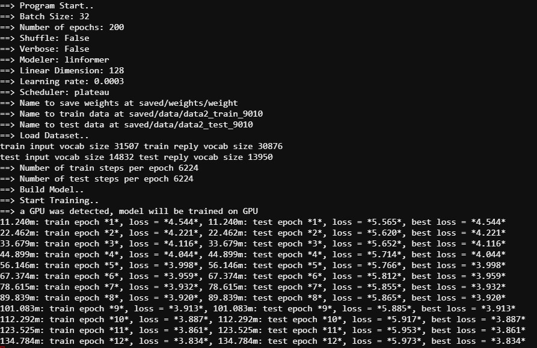

# chatbot-Transformer-&-Linformer

## Introduction (A description of the project)

Transformer has revolutionized the Natural Language Processing field with the attention mechanism. Some of the groundbreaking NLP models (GPT3 and BERT) of recent years are all based on transformer. However, the time and space complexity of transformer is largely dependent on the size of the input sequence. More specifically, the self-attention mechanism of transformer has a time complexity of O(n2) where n is the length of input sequence. Wang et. al. [1] proposed Linformer, a linear complexity O(n) self-attention mechanism, that can speed up the inference speed of the model significantly. We sought to find whether Linformer could be used to train and reduce the inference time in the case of conversational Chatbot, where training input sequences’ lengths are varied.

## Main requirements
- Python 3.6 to 3.8 (3.6 preferred)*

*Require for many dependencies in requirement.txt
## How to Start
- install dependencies

`$ pip install -r requirements.txt`

- test run on default setting

`python main.py`

## A description of the repository and code structure

## Example commands to execute the code         

## Results (including charts/tables) and your observations  

