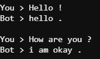
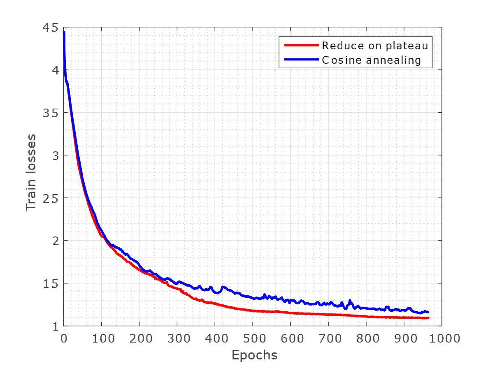
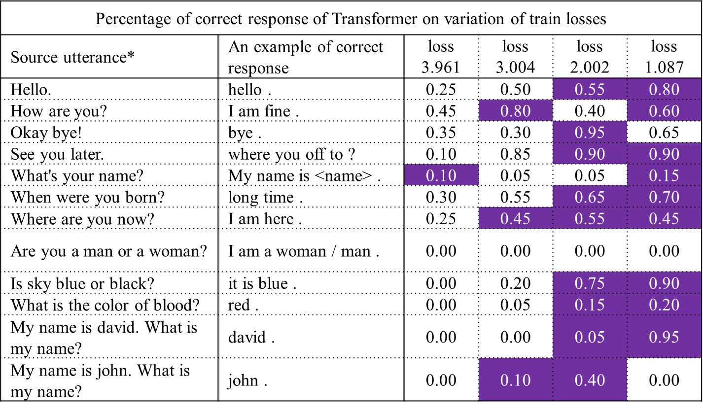
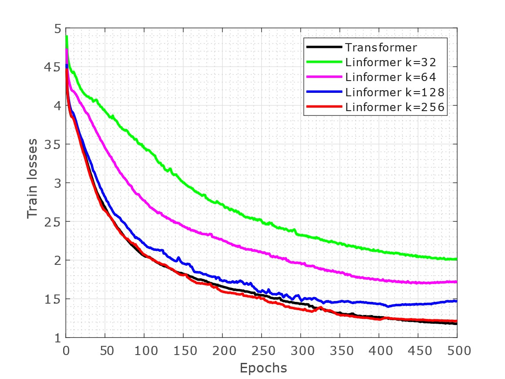
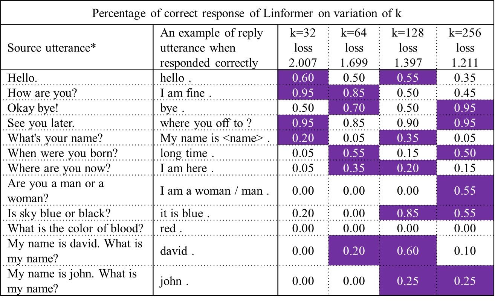

# chatbot-Transformer-&-Linformer

## Introduction

Transformer has revolutionized the Natural Language Processing field with the attention mechanism. Some of the groundbreaking NLP models (GPT3 and BERT) of recent years are all based on transformer. However, the time and space complexity of transformer is largely dependent on the size of the input sequence. More specifically, the self-attention mechanism of transformer has a time complexity of O(n2) where n is the length of input sequence. Wang et. al. \[[1](#references)\] proposed Linformer, a linear complexity O(n) self-attention mechanism, that can speed up the inference speed of the model significantly. We sought to find whether Linformer could be used to train and reduce the inference time in the case of conversational Chatbot, where training input sequences’ lengths are varied.

## Main requirements
- Python 3.6 to 3.8 (3.6 preferred)*

\*Require for many dependencies in requirement.txt

## Special Thanks

This GitHub Repository's implementation heavily influenced by Chloerobotics \[[5](#references)\]

## How to Start
```
# Install dependencies
$ pip install -r requirements.txt

# Test run on default setting
$ python main.py

# A successful run should look like this
```


## Main.py adjustable parameters
| Description | DType       | Arguments  | Default | 
| ----------- | ----------- | ---------- | ------- | 
| Name to save weights, at /saved/weights/<name> | string | --weight | "weight" | 
| Name of train data, at /saved/data/<name> | string  | --train | "data2_train_9010" | 
| Name to test data, at /saved/data/<name> | string  | --test | "data2_test_9010" | 
| Batch size | int  | --batch | 32 | 
| # of epochs | int | --epoch | 200 | 
| Modeler: Transformer or Linformer | string | --modeler | "Linformer" | 
| Linear Dimension of Linformer | int | --linear_dimension | 256 | 
| Scheduler: plateau, cosine or warmup | str | --scheduler | "plateau" | 
| Dimension of Attention Layers | int | --dimension | 512 | 
| Number of Attention Layers | int | --nlayers | 6 | 
| Number of Attention Heads | int | --heads | 8 | 
| learning rate | float | --lr | 0.0003 | 

## How to chat with your saved model
```
# For Transformer run
$ python bot.py --model transformer --weight PATH

# For Linformer run
$ python bot.py --model linformer --weight PATH -- linear_dimension SAME_AS_WEIGHT_SETTING

# You should see a prompt like this:
```


## Bot.py adjustable parameters
| Description | DType       | Arguments  | Default | 
| ----------- | ----------- | ---------- | ------- | 
| Name to save weights, at /saved/weights/<name> | string | --weight | "weight" | 
| Modeler: transformer or linformer | string | --modeler | "linformer" | 
| Linear Dimension of Linformer | int | --linear_dimension | 256 | 

## Repository and code structure
- Execution files are locating in the root directory.
- Transfomer model, Linformer model, and Tokenizer script are in "scripts" directory.
- Default saved weight location is "saved/weight" directory.
- Default data location is "saved/data" directory.
      
## Results

### Selecting Learning Rate

- We've found the best learning rate at 0.0003 


### Selecting scheduler and number of epochs

- We've chosen "Reduce on Plateau" as our learning rate scheduler.
- Also we've selected 500 epochs for further training because the training losses are flatten after 500 epochs. 



### Where are the correct response?

- We've seen that at training loss between 1 and 2 the probability of correct response is attractive.



### What are linear dimension for Linformer that reached loss of 2

- K between 32 and 256 could reach loss of 2



### Our Linformer Results

- K = 32 works better with simple question
- K = 256 works better with more sophisticated question



### Comparing total execution time at 500 epochs

- Linformer does not reduce inference time for Conversational Chatbot


## Conclusion

Although we have successfully built Conversational Chatbot on both Transformer and Linformer, our Linformer does not reduce inference time when compared to traditional Transformer. The reason is that Conversational Chatbot usually contain less than 32 words for each utterance. Instead of reducing trainable parameters, we increase the trainable parameter by introducing E and F matrices. Rather than computing only 3 matrices QKV, we now have 5 matrices to work with.

## <a id="references">References</a>

- [1] Linformer: Self-Attention with Linear Complexity: https://arxiv.org/pdf/2006.04768.pdf
- [2] Cornell Movie-Dialog Corpus Dataset: https://www.cs.cornell.edu/~cristian/Cornell_Movie-Dialogs_Corpus.html
- [3] Deep Learning Based Chatbot Models,  https://arxiv.org/pdf/1908.08835.pdf
- [4] Attention is All You Need, https://arxiv.org/abs/1706.03762
- [5] Chloerobotics, https://github.com/chloerobotics/chloebot
